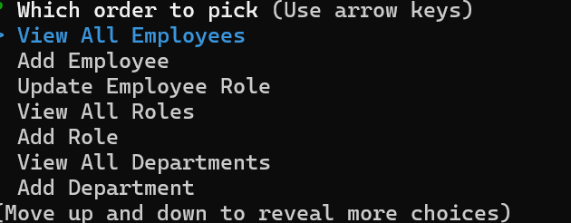
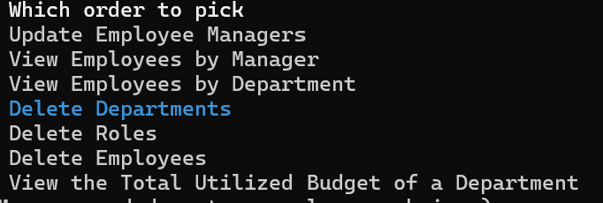

# Employee_Manager

## Description

The Employee Manager uses the MySQL Database to manage departments, roles, and employees with relational database tables. Each table has an id primary key. role has a foreign key to departments, employee has a foreign key to role and a self join for manager. The application manages insertions, selections, updates, and deletions. The Inquirer package is used to present the main menu and submenus for the given transactions
 and . View transactions, roles, and departments are select queries.
However additions, updates, and deletions require submenus and foreign key values. To update the role for an employee the submenu will prompt to select the user from the employee list and what to change the employee's role to from the roles list. Inquirer is used to prompt the user menu entries and selections. The code imports four classes
EmployeeDb, Department, Role, and Employee. The parent class Employee_Db connects to MySQL and contains two methods getData and setData. The child classes inherit these methods to run queries. The child classes contain and return queries to the main program specific for each table in the database.

## Installation

N/A

## Usage

The user is presented with the main menu to manage the employee database
View all Employees, View All Departments, View All Roles, Add a Department, Add a Role,
Add an Employee, and Update an Employee Role.
Selecting
View all Employees
Displays the employees ids, first names, last names, role titles, department names, salaries, and managers
View All Departments
Displays the Department id and name
View All Roles
Displays role titles, role ids, the department names the role belongs to, and the salary for the role
Add a Department
Prompts for the new department name and adds the entry to the database
Add a Role
Prompts for the name, salary, department and adds the entry to the database
Add an Employee
Prompts for the first name, last name, role name, manager and adds the entyry to the database
Update an Employee Role
Prompts for the employee to update, the new role and updates the record in the database
Additional features include updating an employees manager, viewing employees from a department, viewing employees from a manager. Deleting roles, departments, and employees. Displaying the total utilized budget by department.

Screencastify link:
https://drive.google.com/file/d/15dUYOMul4f5KyRN70oG2Zfv5ayZXdbiI/view

The link to the GitHub repository is:
https://github.com/rethomas67/Dynamic_ReadMe/tree/main/Develop

## Credits

N/A

## License

N/A
